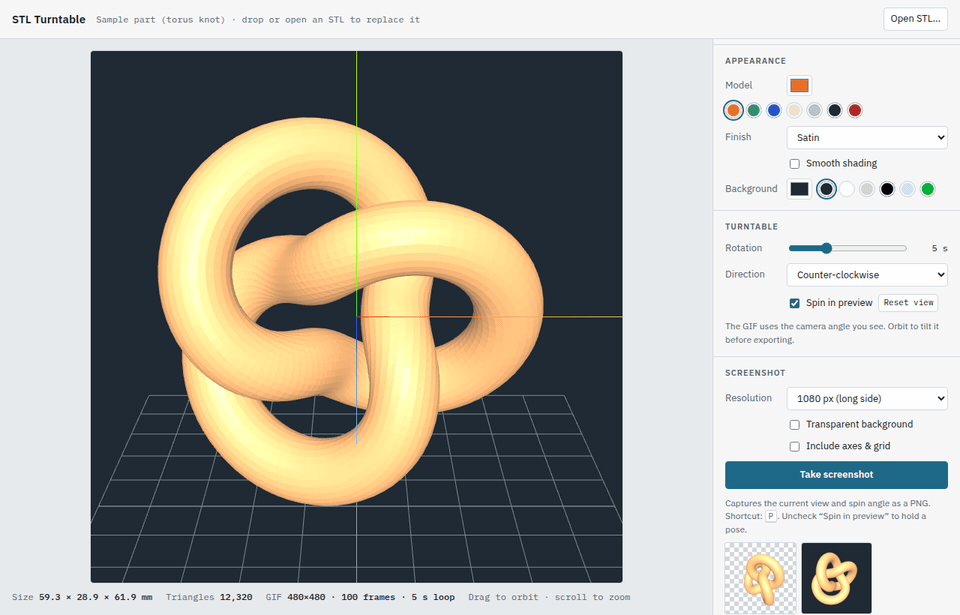

# STL Turntable

A lightweight, single-file web app for turning an STL model into a slowly spinning turntable GIF. Load a model, line it up with the X/Y/Z axes, choose a color, finish and background, and export a looping GIF or still PNG screenshots. There is nothing to install and no build step. Everything runs in your browser.



## Features

- **Load STL files:** open or drag and drop ASCII or binary STL files. The model is centered automatically, and its size (mm) and triangle count are shown.
- **Align to the axes:** choose Z-up (CAD / slicer exports) or Y-up, then adjust each axis with a slider or ±90° step buttons. Axis and grid guides help you line things up. They are never included in GIF exports.
- **Appearance:** pick a model color or use one of the filament-style presets. Finishes include Matte PLA, Satin, Glossy/resin, Metallic, Clay render, Wireframe and a Normal-map (rainbow) mode, with an optional smooth-shading setting.
- **Background:** any solid color, with presets including studio white and chroma green.
- **Turntable GIF export:** exactly one full revolution per loop, with a seamless wrap. Set the rotation time (2–12 s), direction, size (320–800 px), frame shape (1:1, 4:3, 16:9, 4:5) and frame rate (10–25 fps).
- **Screenshots:** save PNGs of the current view at 1080 px, 2160 px (4K) or the GIF's size, with an optional transparent background. Press <kbd>P</kbd> to take one.
- **What you see is what you get:** exports use the camera angle you set by orbiting in the viewer.

## Getting started

### Run it locally

Download `stl-turntable.html` and open it in a modern browser (Chrome, Edge, Firefox or Safari). An internet connection is needed the first time it loads, because the 3D and GIF libraries are fetched from a CDN.

## How to use it

1. **Open an STL.** Click **Open STL…** or drop a file onto the viewer. A sample torus knot is loaded until you do.
2. **Align it.** Most CAD and slicer exports are Z-up, which is the default. Use the rotate sliders or ±90° buttons until the model sits the way you want. The green axis (Y) is the spin axis.
3. **Style it.** Pick a model color, finish and background.
4. **Frame it.** Drag to orbit and scroll to zoom. **Reset view** refits the model.
5. **Export.** Click **Make GIF**, then **Save GIF**. To take stills, uncheck **Spin in preview**, pose the model, and press **Take screenshot** (or <kbd>P</kbd>).

## Tips

- **Loop timing:** GIF frame delays are stored in hundredths of a second. At 10, 20 and 25 fps the loop plays back in exactly the rotation time you set. At 15 fps each frame is rounded to 0.07 s, so a 5 s rotation plays back in about 5.25 s.
- **File size:** size scales with pixel dimensions × frame count. To make a GIF smaller, lower the size or frame rate, or shorten the rotation time.
- **Normal-map finish:** it uses a wide range of hues, so it produces larger GIFs and can show some color banding. Leaving smooth shading off (flat facets) compresses better.

## How it works

| Piece | Library |
|---|---|
| 3D rendering, STL parsing, orbit controls, lighting environment | [three.js](https://threejs.org/) r147 (UMD build, plus `STLLoader`, `OrbitControls`, `BufferGeometryUtils`, `RoomEnvironment`) |
| GIF encoding and color quantization | [gifenc](https://github.com/mattdesl/gifenc) 1.0.3 |

Both libraries load from [jsDelivr](https://www.jsdelivr.com/). The whole app lives in `stl-turntable.html`.

To make a GIF, the app renders each frame at the export size with the model rotated by `360° / frames`, reduces each frame to a 256-color palette, and encodes it. Your STL never leaves your computer.

```
